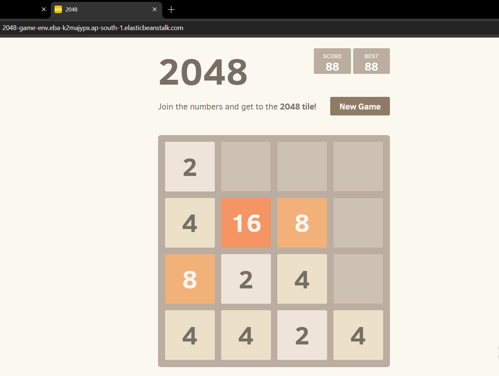

#  2048 Game Deployment using Docker & AWS Elastic Beanstalk

##  Project Overview

This project demonstrates how to containerize a web application (2048 Game) using Docker and deploy it on AWS Elastic Beanstalk.

The application is served using Nginx inside a Docker container and hosted on AWS with a public URL.

---

##  Tech Stack

* Docker
* AWS Elastic Beanstalk
* IAM (Identity and Access Management)
* Nginx
* Ubuntu

---

##  Project Structure

```
2048/
│── Dockerfile
│── README.md
│── images/
│    └── output.png
```

---

##  Docker Setup

### Build Docker Image

```bash
docker build -t 2048-game .
```

### Run Container (Optional - Local Testing)

```bash
docker run -d -p 80:80 2048-game
```

---

##  AWS Deployment (Elastic Beanstalk)

### Steps:

1. Created Elastic Beanstalk environment
2. Configured IAM roles:

   * Service Role (Elastic Beanstalk)
   * EC2 Instance Profile
3. Selected Docker platform
4. Uploaded project files
5. Deployed application successfully

---

##  Application URL

```
http://<your-elastic-beanstalk-url>
```

---

##  Application Output

<p align="center">
  
</p>

---

##  Challenges Faced & Fixes

###  Docker Engine Error

**Issue:**

```bash
dockerDesktopLinuxEngine not found
```

**Solution:**

* Started Docker Desktop
* Restarted WSL

---

###  Invalid ZIP File Error

**Issue:**

```bash
unzip: cannot find zipfile directory
```

**Cause:**

* Used incorrect GitHub `.git` URL instead of ZIP download link

**Fix:**

```bash
curl -L -o master.zip https://github.com/gabrielecirulli/2048/archive/refs/heads/master.zip
```

**Additional Fix:**

* Extracted `2048-master` folder and moved files to `/var/www/html`

---

##  Key Learnings

* Docker containerization
* Deploying applications using AWS Elastic Beanstalk
* IAM role configuration
* Debugging real-world deployment issues

---

##  Future Improvements

* Add CI/CD pipeline (GitHub Actions / Jenkins)
* Deploy using Kubernetes
* Configure HTTPS with custom domain

---

##  Author

**Meghaa**

---

##  Acknowledgment

This project was built as part of hands-on DevOps learning and practice.
